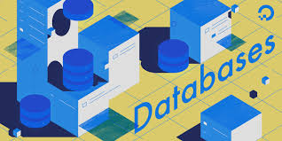

# Rethima-Reddy.github.io
## DATA BASE

### Contents
<ul>
  <li>Introduction to Database</li>
  <li>Advantages of DataBase</li>
  <li>Disadvantages of DataBase</li>
</ul>
### Introduction to database

  A database is an organized collection of data, generally stored and accessed electronically from a computer system. Where databases are more complex they are often developed using formal design and modeling techniques.

The database management system (DBMS) is the software that interacts with end users, applications, and the database itself to capture and analyze the data. The DBMS software additionally encompasses the core facilities provided to administer the database. The sum total of the database, the DBMS and the associated applications can be referred to as a "database system". Often the term "database" is also used to loosely refer to any of the DBMS, the database system or an application associated with the database.

Computer scientists may classify database-management systems according to the database models that they support. Relational databases became dominant in the 1980s. These model data as rows and columns in a series of tables, and the vast majority use SQL for writing and querying data. In the 2000s, non-relational databases became popular, referred to as NoSQL because they use different query languages.

### Advantages of DataBase 
<ol type="a">
  <li>Reduced data redundancy</li>
  <li>Reduced updating errors and increased consistency</li>
  <li>Greater data integrity and independence from applications programs</li>
  <li>Improved data access to users through use of host and query languages</li>
  <li>Improved data security</li>
  <li> Facilitated development of new applications program </li>
  <li>  Reduced data entry, storage, and retrieval costs</li>
</ol>
### Disadvantages of DataBase
<ol type="a">
  <li> Database systems are complex, difficult, and time-consuming to design </li>
  <li> Substantial hardware and software start-up costs</li>
  <li> Damage to database affects virtually all applications programs</li>
  <li> Extensive conversion costs in moving form a file-based system to a database system</li>
  <li> Initial training required for all programmers and users</li>
</ol>
